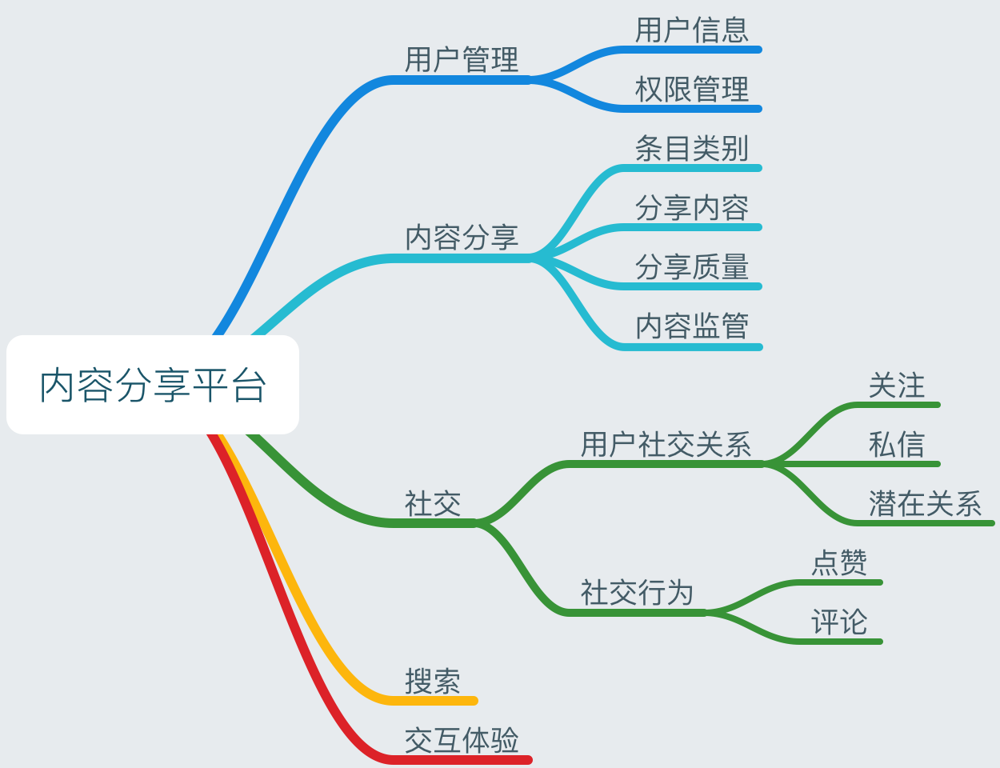

# Web 项目建议书

我们小组所要完成的项目是实现一个类似于 Reddit 的内容分享平台。此应用将采用微服务架构实现，并且支持分布式扩展、容错和高可用。本项目的思路来源于 [MIT 6.824 Distributed Systems - Final Project](https://pdos.csail.mit.edu/6.824/project.html)。

## 系统简介

建立一个集社交、新闻、网络评价与讨论的多功能网站。在网站中，注册成员可以向网站提交自己的文本帖子或者是一些网页链接，接下来由其他注册用户投票或下载，来改变所提交内容的位置，类同与微博的热搜榜。而每个用户也会得到网站的一些推荐内容（根据自己平时的浏览习惯与记录）。

## 网站描述

该网站是由注册用户提交的条目的集合，相当于一个公告板系统。其中分有多个类别，如教育类、新闻类、体育之类的类别。

当项目（链接或文本帖子）被提交给子项目时，被称为“ 浏览者 ” 的用户可以投票赞成或反对他们（upvote / downvote）。每个提交者都有一个首页，显示已被高度评价的较新的提交。引用者还可以发表关于提交的评论，并在评论的谈话树中来回回答; 评论本身也可以被提升和降级。网站的首页本身显示用户订阅的所有子项目中最高评分的帖子的组合。

首页排名 - 一般首页和个人备注 - 由提交年龄，积极（“upvoted”）到否定（“downvoted”）反馈比率和总投票数决定。每天提交数十份提交的内容。

虽然大部分的网站功能像布告栏或留言板，但每个区域都可以选择拥有相关的 Wiki，可以为现实生活中的事件提供指导，推荐阅读或协作等补充材料。

## 用户

用户可以注册来进行各种各样的社交活动。当登录时，网站用户能够投票提交和评论，以增加或降低其可见性并提交链接和评论。用户还可以根据他们选择的主题创建自己的社区，感兴趣的用户可以通过订阅将其添加到他们的首页。

## 体系结构

